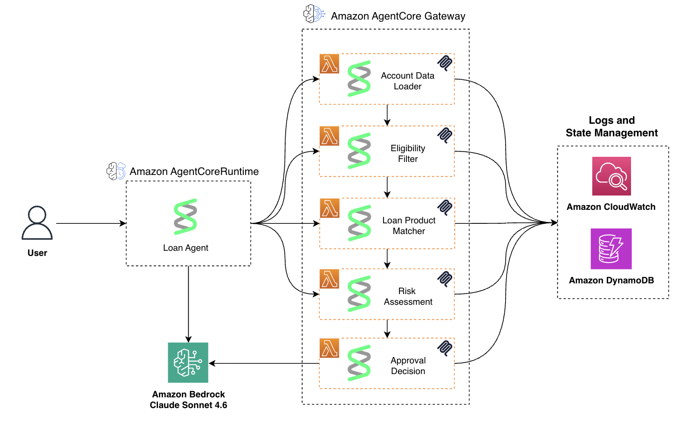

# UK Short-Term Loan Processing Workshop

A multi-agent loan processing system built with the [Strands Agents SDK](https://strandsagents.com/) on AWS. Five specialist agents run as Lambda functions, each handling one FCA-regulated stage of a loan application. Claude on Amazon Bedrock provides LLM reasoning, and DynamoDB stores shared pipeline state.



## Table of Contents

- [Architecture](#architecture)
- [Pipeline Stages](#pipeline-stages)
- [Project Structure](#project-structure)
- [Prerequisites](#prerequisites)
- [Getting Started](#getting-started)
- [Deploying Agents](#deploying-agents)
- [Testing](#testing)
- [Production Deployment (AgentCore)](#production-deployment-agentcore)
- [Tool Reference](#tool-reference)
- [UK Financial Standards](#uk-financial-standards)
- [Environment Variables](#environment-variables)
- [Workshop Fixed Values](#workshop-fixed-values)

## Architecture

The system supports two execution modes:

### Development (MCP Server)

```
Claude Code --> MCP Server (local server.py, stdio) --> 5 Lambda Agents --> DynamoDB / Bedrock
```

A local MCP server (`mcp_server/server.py`) receives tool calls from Claude Code, invokes each Lambda agent in sequence, threads context between stages, and returns the final result. Configuration lives in `.mcp.json`.

### Production (AgentCore Runtime)

```
Browser --> Flask App --> AgentCore Runtime (Orchestrator) --> AgentCore Gateway --> 5 Lambda Agents --> DynamoDB / Bedrock
```

The orchestrator (`agentcore/loan_orchestrator.py`) runs on [Amazon Bedrock AgentCore](https://aws.amazon.com/bedrock/agentcore/) Runtime. It connects to an AgentCore Gateway that exposes the Lambda agents as MCP tools. A Flask frontend (`agentcore/app.py`) streams NDJSON events to the browser in real time.

## Pipeline Stages

Each agent owns one stage of the loan journey. Agents 1-4 use deterministic tool logic; Agent 5 uses LLM reasoning for the final approval decision.

| Stage | Agent | Purpose |
|-------|-------|---------|
| 1 | **Account Data Loader** | Account creation, OTP verification, password setup |
| 2 | **Eligibility Filter** | Open Banking verification, NINO check, income assessment (hard gate) |
| 3 | **Loan Product Matcher** | Sort code lookup, FCA-compliant loan creation, Direct Debit setup |
| 4 | **Risk Assessment** | Transaction PIN creation and validation |
| 5 | **Approval Decision** | LLM-powered final approval, Confirmation of Payee, Faster Payments disbursement |

Stage 2 is a hard gate: if the customer is ineligible (income below threshold or identity checks fail), the pipeline stops immediately.

## Project Structure

```
workshop/
├── agents/
│   ├── account_data_loader/main.py     # Agent 1
│   ├── eligibility_filter/
│   │   ├── main.py                     # Agent 2
│   │   └── policies/eligibility.cedar  # Cedar authorization policies
│   ├── loan_product_matcher/
│   │   ├── main.py                     # Agent 3
│   │   └── policies/loan_product.cedar
│   ├── risk_assessment/
│   │   ├── main.py                     # Agent 4
│   │   └── policies/risk.cedar
│   └── approval_decision/main.py       # Agent 5
├── mcp_server/
│   └── server.py                       # Local MCP server (stdio transport)
├── agentcore/
│   ├── loan_orchestrator.py            # AgentCore Runtime orchestrator
│   ├── app.py                          # Flask chat frontend (English)
│   ├── app-kor.py                      # Flask chat frontend (Korean)
│   ├── setup_gateway.py                # Create AgentCore Gateway + targets
│   ├── deploy_runtime.py               # Deploy orchestrator to AgentCore
│   └── gateway-config.json             # Gateway target configuration
├── solutions/
│   ├── risk_assessment_solution.py     # Reference implementation for Agent 4
│   └── approval_decision_solution.py   # Reference implementation for Agent 5
├── scripts/
│   ├── deploy-agent.sh                 # Deploy agent to Lambda
│   ├── agent-status.sh                 # Check agent deployment status
│   ├── enable-agent.sh                 # Enable a Lambda agent
│   ├── delete-agents.sh                # Remove deployed agents
│   └── cleanup.sh                      # Full cleanup
├── .mcp.json                           # MCP server configuration
├── requirements.txt                    # Python dependencies
└── CLAUDE.md                           # Claude Code project instructions
```

## Prerequisites

- Python 3.10+
- AWS CLI configured with credentials
- Access to Amazon Bedrock (Claude Sonnet 4.6)
- Pre-deployed CloudFormation stack (Lambda functions, DynamoDB table, Lambda layer)

## Getting Started

1. **Install dependencies:**

   ```bash
   pip install -r requirements.txt
   ```

2. **Verify AWS access:**

   ```bash
   aws sts get-caller-identity
   ```

3. **Deploy an agent** (from the repo root):

   ```bash
   ./scripts/deploy-agent.sh account-data-loader
   ```

4. **Test via MCP** in Claude Code using the `test_agent` or `process_loan` tools exposed by the MCP server.

## Deploying Agents

The deploy script packages an agent's `main.py` (plus Cedar policies if present), uploads it to the pre-existing Lambda function, and attaches the Strands SDK layer.

```bash
./scripts/deploy-agent.sh <agent-name>
```

Available agents:

| Agent Name | Workshop Chapter |
|------------|-----------------|
| `account-data-loader` | Chapter 2 |
| `eligibility-filter` | Chapter 3 |
| `loan-product-matcher` | Chapter 4 |
| `risk-assessment` | Chapter 5 |
| `approval-decision` | Chapter 5 |

The script accepts both hyphens and underscores (`risk-assessment` or `risk_assessment`). Lambda function names follow the pattern `strands-loan-workshop-<agent-name>`.

## Testing

### Test a single agent

Use the `test_agent` MCP tool in Claude Code:

```
Using our MCP server, test the account-data-loader agent with a loan request
for Sarah Johnson, email sarah@example.com, phone +447911123456.
```

### Run the full pipeline

Use the `process_loan` MCP tool:

```
Using our MCP server, process a loan application for Sarah Johnson.
Phone: +447911123456, email: sarah@example.com.
Open Banking token: OB-TOKEN-12345678. NINO: AB123456C.
Employed at Acme Ltd, salary £2,500/month, salaried.
Requesting £2,000 over 60 days for home repairs.
Bank: Monzo, account 12345678.
```

### Check loan status

Use the `get_loan_status` MCP tool with the `account_id` returned during processing.

## Production Deployment (AgentCore)

1. **Create the Gateway and Lambda targets:**

   ```bash
   cd agentcore
   python3 setup_gateway.py
   ```

2. **Deploy the orchestrator to AgentCore Runtime:**

   ```bash
   python3 deploy_runtime.py
   ```

3. **Run the chat frontend:**

   ```bash
   python3 app.py          # English UI at http://localhost:3000
   python3 app-kor.py      # Korean UI at http://localhost:3000
   ```

The frontend streams real-time progress events showing which specialist agent is currently processing.

## Tool Reference

| Agent | Tool | Description |
|-------|------|-------------|
| **Account Data Loader** | `create_account` | Create account, trigger OTP to email |
| | `verify_otp` | Validate email OTP |
| | `set_temporary_password` | Set system credentials |
| **Eligibility Filter** | `verify_open_banking` | FCA Open Banking consent verification |
| | `verify_national_insurance` | UK NINO check (format `AB123456C`) |
| | `add_employment_details` | Monthly income in GBP, employer, employment type |
| | `check_eligibility_status` | Final eligibility decision (Cedar-enforced) |
| | `get_eligibility_reasons` | Detailed denial reasons when blocked by policy |
| **Loan Product Matcher** | `get_sort_code` | Resolve UK bank name to sort code (`XX-XX-XX`) |
| | `create_loan` | Create loan (£500-£5,000, 30-90 days, 0.8%/day FCA cap) |
| | `setup_repayment` | Configure Direct Debit mandate |
| **Risk Assessment** | `create_pin` | Create 4-digit transaction PIN (SHA-256 hashed) |
| | `validate_pin_for_disbursement` | Validate PIN before fund release |
| **Approval Decision** | `approve_loan` | Final loan approval (requires PIN validated + eligible) |
| | `verify_bank_account_name` | Confirmation of Payee (CoP) check |
| | `add_bank_account` | Link UK bank account for disbursement |
| | `disburse_loan` | Transfer via Faster Payments Service |

## UK Financial Standards

This system implements FCA-regulated UK financial processes:

| Concept | Standard | Details |
|---------|----------|---------|
| Identity verification | Open Banking (FCA-regulated) | Customer authorises access via consent token |
| Government ID | National Insurance Number (NINO) | Format: `AB123456C` |
| Bank routing | Sort code (6-digit `XX-XX-XX`) | e.g. Barclays `20-00-00`, Monzo `04-00-04` |
| Account number | 8-digit UK standard | |
| Payment transfer | Faster Payments Service (FPS) | Arrives within 2 hours |
| Identity check | Confirmation of Payee (CoP) | Verifies account name matches applicant |
| Currency | GBP | Loan range £500-£5,000 |
| Interest rate cap | 0.8% per day | FCA short-term credit cap |
| Total cost cap | 100% of principal | FCA consumer protection rule |

Eligibility thresholds: minimum £1,600/month (salaried) or £2,500/month (self-employed). Maximum loan amount is the lesser of 3x monthly salary or £5,000.

## Cedar Authorization

Agents 2-4 use [Cedar](https://cedarpolicy.com/) policies for declarative, identity-aware access control over tool calls. Policies are stored as `.cedar` files alongside each agent. Cedar enforces preconditions (e.g., Open Banking and NINO must be verified before eligibility check) and uses default-deny semantics.

## Environment Variables

| Variable | Default | Used By |
|----------|---------|---------|
| `AWS_DEFAULT_REGION` | `us-east-1` | All |
| `PROJECT_NAME` | `strands-loan` | MCP server, scripts |
| `ENVIRONMENT` | `workshop` | MCP server, scripts |
| `DYNAMODB_TABLE` | `strands-loan-workshop-loan-applications` | All agents |
| `BEDROCK_MODEL_ID` | `us.anthropic.claude-sonnet-4-6` | All agents |
| `GATEWAY_URL` | -- | AgentCore orchestrator |
| `STACK_NAME` | `strands-workshop` | Setup/deploy scripts |

## Workshop Fixed Values

In workshop mode, the following values are hardcoded for demonstration:

| Value | Fixed To |
|-------|----------|
| OTP | `123456` |
| Temporary password | `TempPass123!` |
| Transaction PIN | `1234` |

## Key Technologies

- [Strands Agents SDK](https://strandsagents.com/) -- Agent framework with Bedrock model integration
- [Amazon Bedrock](https://aws.amazon.com/bedrock/) -- Claude Sonnet 4.6 for LLM reasoning
- [Amazon Bedrock AgentCore](https://aws.amazon.com/bedrock/agentcore/) -- Production orchestration with session management and streaming
- [AWS Lambda](https://aws.amazon.com/lambda/) -- Serverless agent deployment
- [Amazon DynamoDB](https://aws.amazon.com/dynamodb/) -- Shared state across the pipeline
- [MCP (Model Context Protocol)](https://modelcontextprotocol.io/) -- Standard protocol for AI tool discovery and invocation
- [Cedar](https://cedarpolicy.com/) -- Declarative authorization policies for tool-call gating
