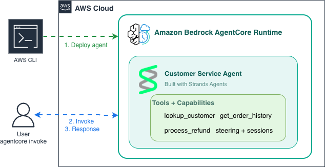

# Module 5: Deploy to AgentCore Runtime

Deploy the customer service agent you built in Modules 1-4 to **Amazon Bedrock AgentCore Runtime** - a managed runtime for hosting agents with no servers to manage. You bring your existing `main.py`; the `agentcore` CLI packages and deploys it.

> AgentCore (Amazon Bedrock AgentCore) is a managed runtime for hosting agents. See the [AgentCore docs](https://docs.aws.amazon.com/bedrock-agentcore/latest/devguide/?trk=87c4c426-cddf-4799-a299-273337552ad8&sc_channel=el).

## What you'll build

A deployable agent wrapped in `BedrockAgentCoreApp` with an `@app.entrypoint`, deployed with the `agentcore` CLI and invoked both from the CLI and with boto3.

## Architecture



`agentcore deploy` packages your agent code, zips it to an Amazon S3 staging bucket (the default Direct Code Deploy build - no container), and provisions the AgentCore Runtime via AWS CloudFormation. At invocation, an IAM execution role grants the runtime access to Amazon Bedrock for inference, the agent runs its tools, and Amazon CloudWatch captures logs and traces.

## Prerequisites

- **Node.js 20+** and the AgentCore CLI: `sudo npm install -g @aws/agentcore` (a global install needs root)
- **uv** (for the Python project) and **AWS credentials** with AgentCore access
- Do **not** install the old `bedrock-agentcore-starter-toolkit` - it conflicts with the current CLI (its `configure` command no longer exists here).

## Files

| File | Purpose |
|------|---------|
| `module-05-deploy.ipynb` | Walkthrough of the deploy steps |
| `main.py` | Deployable entrypoint (`BedrockAgentCoreApp` + agent) |
| `customer_service_tools.py` | Mock tools (from Module 1) |
| `steering_handlers.py` | Steering handlers (from Module 3) |
| `skills/` | Workflow skills (from Module 3) |
| `requirements.txt` | `strands-agents`, `bedrock-agentcore`, `aws-opentelemetry-distro`, `boto3` |

## How do I deploy it?

Run these from this folder (`samples/05-deploy`):

```bash
# 1. Create the project (interactive): enter a name, then choose "Skip"
agentcore create

# 2. Move into the project the CLI just created
cd <project-name>

# 3. Add your existing agent (interactive): agent -> name ->
#    "Bring my own code" -> Enter (code location) -> Enter (entrypoint) ->
#    "Direct Code Deploy" -> "Amazon Bedrock" -> Enter (advanced) -> confirm
agentcore add

# 4. Copy your agent code into the app folder the CLI created
cp ../main.py ../customer_service_tools.py ../steering_handlers.py ../requirements.txt app/MyAgent/
cp -r ../skills app/MyAgent/

# 5. Set up dependencies in app/MyAgent/ (creates pyproject.toml + .venv)
cd app/MyAgent
uv init --bare --python 3.13
uv add strands-agents bedrock-agentcore aws-opentelemetry-distro boto3
cd ../..

# 6. Test locally, then deploy and invoke
agentcore dev                                          # local server for testing
agentcore deploy                                       # package to S3 + provision runtime
agentcore invoke "Hi, I'm customer C-1001. What are my recent orders?"

# Keep context across calls with --session-id (must be at least 33 characters)
agentcore invoke --session-id customer-1001-session-refund-000001 "I need a refund for order ORD-5521"
```

(Adjust `MyAgent` to the name you chose.) The `uv init` / `uv add` step is required: `agentcore deploy` builds from a `pyproject.toml`, and `agentcore dev` needs the `.venv`. A `--session-id` shorter than 33 characters fails with `Value at 'runtimeSessionId' failed to satisfy constraint: Member must have length greater than or equal to 33`.

## Invoke from code (boto3)

`agentcore invoke` is for testing; in production you call the runtime with the AWS SDK. Get the ARN with `agentcore status`, then:

```python
import json, uuid, boto3

client = boto3.client("bedrock-agentcore", region_name="us-east-1")
response = client.invoke_agent_runtime(
    agentRuntimeArn="<ARN from agentcore status>",
    runtimeSessionId=str(uuid.uuid4()),
    payload=json.dumps({"prompt": "Hi, I'm customer C-1001. What are my recent orders?"}).encode(),
    qualifier="DEFAULT",
)
print("".join(chunk.decode("utf-8") for chunk in response.get("response", [])))
```

## Cleanup

Cleanup is two steps - reset the config, then deploy the empty state so AWS removes the resources:

```bash
agentcore remove all -y    # clears the local config (does NOT touch AWS yet)
agentcore deploy           # applies the teardown - removes the runtime from AWS
```

`agentcore remove all -y` only resets the local project config; the follow-up `agentcore deploy` actually deletes the AgentCore Runtime and its CloudFormation stack.

## What's next

This completes the core path - you've built and deployed a production agent. Two optional modules extend the same agent: **[Module 6: Multi-Agent](../06-multi-agent/)** adds delegation to a specialist, and **[Module 7: Evals](../07-evals/)** adds automated quality testing.
